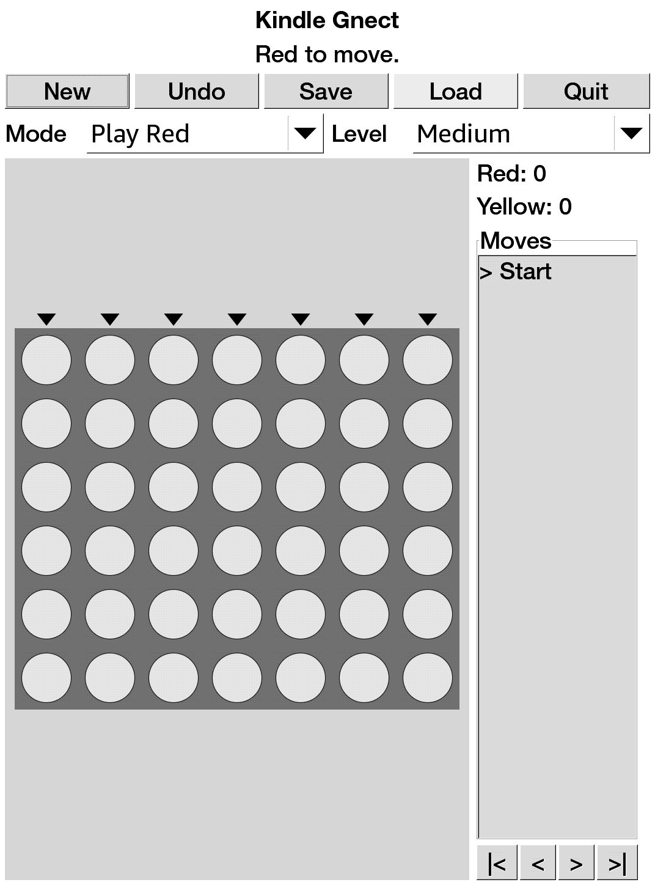

# Exact Four in a Row

A Kindle-friendly Gnect/Connect Four app derived from GNOME Games' Gnect ideas
and assets.



Exact Four in a Row is an unofficial Kindle-focused derivative/adaptation of GNOME
Games' Gnect. It keeps the Gnect/Connect Four game concept, visual assets, and
GNOME Games lineage, while replacing the original GNOME desktop application
shell with a small GTK2/Cairo interface packaged for jailbroken Kindle devices.

This project is also informed by the GnomeGames4Kindle porting work and follows
the same packaging approach used by Kindle GlChess. Original GNOME Games /
Gnect code, ideas, and artwork remain credited to the GNOME Games authors;
Kindle porting groundwork and packaging references are credited to
GnomeGames4Kindle, originally by crazy-electron, and later contributors.

## Features

- Touch-friendly 7x6 Connect Four board.
- Play as red or yellow against the AI, plus two-player and AI demo modes.
- Easy/medium/hard AI levels.
- Legal move hints, score display, move history review controls, undo, save,
  and load.
- E-ink-friendly disc rendering: Red and Yellow are distinguished by contrast,
  labels, and patterns rather than color alone.
- KUAL extension package with bundled ARM runtime libraries.

## Install

Use the prebuilt extension package:

```text
release/exact-four-in-a-row-extension.zip
```

Unzip it at the Kindle USB-storage root so it creates:

```text
/mnt/us/extensions/exact-four-in-a-row
/mnt/us/documents/shortcut_exactfourinarow.sh
```

Then launch from KUAL:

```text
KUAL -> Exact Four in a Row -> Launch
```

The document shortcut is optional. KUAL is the reliable launch path; a stock
Kindle home screen normally will not execute `.sh` files unless another script
launcher/file association is installed.

## Kindle Prerequisites

This is native Kindle homebrew. You need:

- A jailbroken Kindle.
- KUAL installed.
- MRPI installed if your jailbreak/KUAL setup uses MRPI for package installs.
- USB access to copy this extension to `/mnt/us`.

Useful current references:

- Kindle Modding Wiki, jailbreak overview: https://kindlemodding.org/jailbreaking/
- Kindle Modding Wiki, KUAL and MRPI setup: https://kindlemodding.org/jailbreaking/post-jailbreak/installing-kual-mrpi/
- MobileRead KUAL thread: https://www.mobileread.com/forums/showthread.php?t=203326
- MobileRead MRPI wiki: https://wiki.mobileread.com/wiki/MobileRead_Package_Installer
- MobileRead Kindle 5.x jailbreak notes: https://wiki.mobileread.com/wiki/5_x_Jailbreak

Kindle jailbreak compatibility depends on model and firmware. Follow the
current guide for your exact device; do not assume a jailbreak method applies
just because another Kindle model works.

## Build

The supported build path is Docker cross/foreign-architecture build using an
ARMv7 Debian Bullseye container:

```bash
./docker_rebuild.sh
```

That command:

- Builds or starts the persistent `exact-four-in-a-row-armhf-builder` container.
- Compiles the ARM hard-float `exact-four-in-a-row` binary.
- Runs `smoke-test`.
- Packages `dist/exact-four-in-a-row-extension.zip`.

If your Linux Docker install cannot run ARM containers, install binfmt support:

```bash
docker run --privileged --rm tonistiigi/binfmt --install arm
```

See [docs/BUILDING.md](docs/BUILDING.md) for the full build process.

## Release Artifact

The checked-in release artifact is:

```text
release/exact-four-in-a-row-extension.zip
```

Verify it with:

```bash
cd release
sha256sum -c SHA256SUMS
```

## License And Provenance

Exact Four in a Row is not an official GNOME project or an official
GnomeGames4Kindle release. It is a derivative/adaptation project that includes
assets and project lineage from GNOME Games / Gnect and keeps the applicable
GPL-family license texts in `licenses/`. The Kindle-specific application code
in this repository is distributed under the same GPL-family terms to keep the
derivative work redistributable with its GNOME-derived material.

Runtime libraries bundled in the release zip keep their own upstream licenses;
the generated package includes `LICENSES/RUNTIME-LIBS.txt` and
`LICENSES/THIRD-PARTY-NOTICE.txt`.

See [docs/PROVENANCE.md](docs/PROVENANCE.md).

## Publishing Checklist

Before publishing a GitHub release, keep these files together:

- Source tree, including `assets/`, `licenses/`, `docs/`, and `extension/`.
- Binary package: `release/exact-four-in-a-row-extension.zip`.
- Checksum file: `release/SHA256SUMS`.
- Runtime notices embedded inside the zip under `extensions/exact-four-in-a-row/LICENSES/`.
